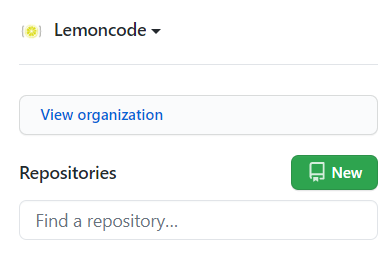
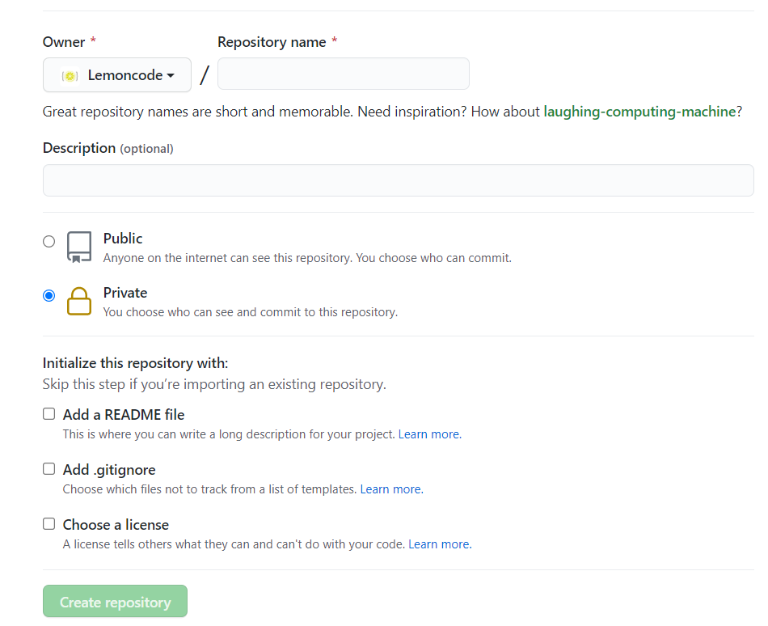
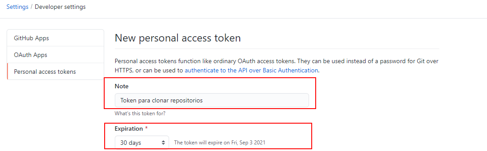
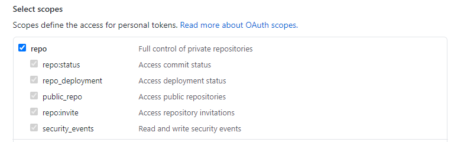
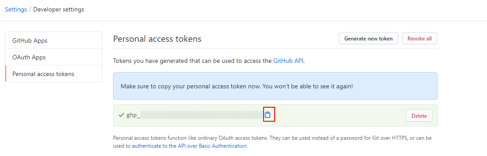
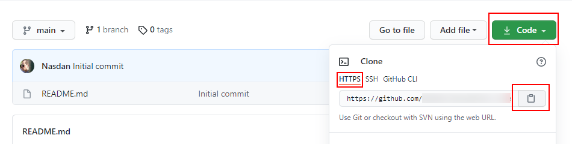

# Personal Access Token


<div style="page-break-before:always"></div>


Hasta ahora, la forma más fácil de poner clonar un repositorio, o subir nuestro código en _Github_ era
usando la *URL* que usa el protocolo *HTTPS*. Estas *URLs* tienen el formato
*`https://github.com/<nombre-usuario>/<nombre-repositorio>.git`* y para
clonarlo solamente necesitamos identificarnos con nuestro nombre de usuario y
la contraseña.
El equipo de _Github_ anunció en julio del 2020 la intención de eliminar la
autenticación de _Git_ usando contraseñas, y en su lugar podemos identificarnos usando
_Personal Access Token_, claves _SSH_, _Github App_, etc.
Desde el 13 de agosto del 2021 ha dejado de estar operativo, por lo qué veremos las diferentes alternativas que tenemos usando el sistema operativo _Windows_.

En este ejemplo veremos cómo crear un _Personal Access Token_ y utilizarlo para
clonar un repositorio de _Github_ en la plataforma _Windows_.

# Manos a la obra

Lo primero será crear nuestro propio repositorio en _Github_, vamos a nuestro
perfil y pulsamos el botón de crear uno nuevo:



Y rellenamos el formulario de creación:



> Aquí podemos crear el repositorio público o privado, en este caso no
> importa.
>
> E incluso podemos seleccionar que añada algún fichero por defecto como el
> README.

A continuación, vamos a crear un `Personal Access Token` el cuál contendrá
los permisos necesarios, para ello, vamos a _Nuestro perfil_ > _Settings_ >
_Developer settings_ > _Personal access tokens_ para generar uno nuevo:


Vamos a darle un nombre para identificarlo, como por ejemplo
`Token para clonar repositorios` y le damos una fecha de expiración:



> Se podría hacer que no expirase, pero esta opción no se recomienda por
> temas de seguridad, es bueno ir renovando de vez en cuando los credenciales.

Por último, nos quedaría darle los permisos necesarios para poder trabajar
con el repositorio, como hacer un clone, realizar commits y push para el
desarrollo de nuestra aplicación:



Y generamos el token pulsando el botón _Generate token_ abajo del todo.

Ahora, hay que copiar el token generado y guardarlo a buen recaudo, ya que
esta será la única vez que podamos verlo. Si por algún motivo lo hemos
perdido, simplemente tendríamos que generar uno nuevo repitiendo el proceso:



Ya estamos listos para volver a la pantalla principal del repositorio que
hemos creado anteriormente, y copiar la URL usando el protocolo _HTTPS_



Vamos a probarlo! Podemos abrir cualquier terminal en nuestra máquina local
donde podamos ejecutar los comandos de _git_ y antes de nada nos aseguramos que
borramos todos los credenciales que tenemos configurados, en
_Windows_ tendríamos que utilizar el _Administrador de credenciales_:


Y eliminamos las credenciales para _Github_:


Ahora en el terminal, clonamos el repositorio usando nuestro usuario y el
_Personal Access Token_ como contraseña:

```bash
git clone https://github.com/<nombre-usuario>/<nombre-repositorio>.git .

```

En este paso, salta un diálogo para introducir nuestro token:


> Ojo: puede que incluso te salten 2 diálogos, simplemente introduce el PAT en ambos.

Así, tenemos disponibles estos credenciales mientras el token sea válido
(recuerda que cuando expiré tendrás que renovarlo desde la propia web de
_GitHub_).
