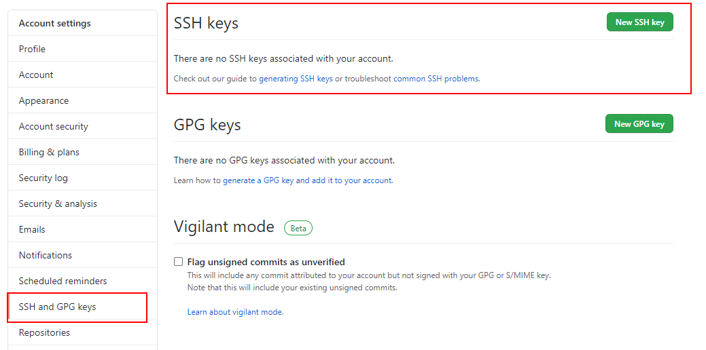
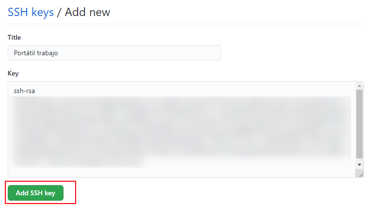
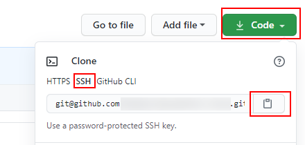
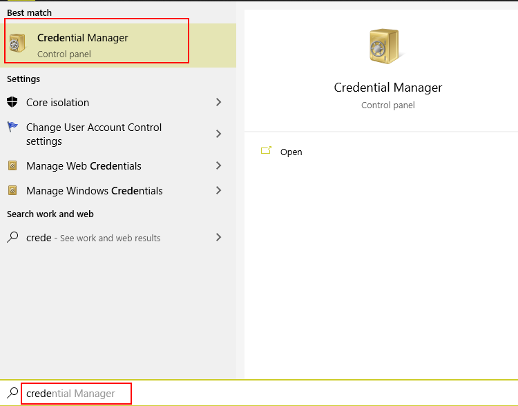
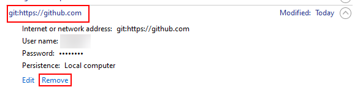

# Clave SSH


<div style="page-break-before:always"></div>

Una opción muy robusta para trabajar con *Git* es usar el protocolo _SSH_, la
única parte negativa es que tiene un poco más de trabajo hacer el setup.

En este caso, vamos a crear nuestras claves _SSH_ usando el sistema
operativo _Windows_ y configurarlas en _Github_ para poder identificarnos.

# Manos a la obra

Para poder generar claves _SSH_ podemos utilizar la herramienta `ssh-keygen`,
esta herramienta viene normalmente instalada en cualquier distribución
_Linux_ o _MacOS_ y para el caso de _Windows_, necesitaremos un terminal con
_bash_ (por ejemplo el terminal que viene al instalar _git_) ya que también
nos instala dicha librería.

Abrimos el terminal de _bash_ y ejecutamos el siguiente comando:

```bash
ssh-keygen -m PEM -t rsa -C <nuestro-email>

> Enter file in which to save the key (/c/Users/<nombre-usuario>/.ssh/id_rsa): (Pulsamos enter para que coja esa ruta por defecto)
> Enter passphrase (empty for no passphrase): `Pulse Enter for empty`
> Enter same passphrase again: `Pulse Enter for empty`
```

Vamos a diseccionar el comando que estamos ejecutando:

> -m PEM: es el formato a aplicar. PEM es un formato muy común para crear
> certificados de clave privada/pública.
>
> rsa: RSA es el algoritmo criptográfico a utilizar.
>
> -C: es un comentario que queramos añadir a la clave ssh, por ejemplo
> nuestro email.
>
> Dejaremos que guarde las claves privada y pública en la carpeta por
> defecto, que es la que usará git luego para poder utilizarla.
>
> Si pulsamos enter, no hace falta añadir ninguna contraseña. Aquí como
> prefieras.

Una vez generadas, debemos de copiar la clave pública (el fichero que termina
en *`.pub`*) para utilizarla en nuestro perfil de _Github_, así cada vez que
nosotros utilicemos la clave privada en nuestra máquina para identificarnos,
_Github_ utilizará la clave pública para poder verificar que los credenciales
usados son correctos.

En _Github_, vamos a _Nuestro perfil_ > _Settings_ > _SSH and GPG keys_ para añadir una nueva:




Vamos a darle un nombre para identificar la máquina donde estamos usando esta
clave *ssh*, por ejemplo, *`Portátil trabajo`* y copiamos el valor de la clave
pública:



Ahora, podemos volver a la pantalla principal del repositorio que hemos
creado anteriormente, y copiar la *URL* usando el protocolo _SSH_



¡Vamos a probarlo! Podemos abrir cualquier terminal en nuestra máquina local
donde podamos ejecutar los comandos de *git*. Vamos a repetir los pasos del
ejemplo anterior para asegurarnos de que borramos todos los credenciales para
forzar a que los pida de nuevo:



Y eliminamos las credenciales para _Github_:



Ahora en el terminal, clonamos el repositorio usando la url copiada:

```bash
git clone git@github.com:<nombre-usuario>/<nombre-repositorio>.git .

```

Nos pide que si queremos usar esa clave *ssh*, escribimos *`yes`*.

A partir de ahora, no preguntará de nuevo por la clave _SSH_ a utilizar ya
que lo ha apuntado en el fichero *`C:/Users/<nombre-usuario>/.ssh/known_hosts`*.

En el caso de que necesitemos autenticarnos en _Github_ en otra máquina,
deberemos de repetir los pasos para poder generar una nueva clave _SSH_.
