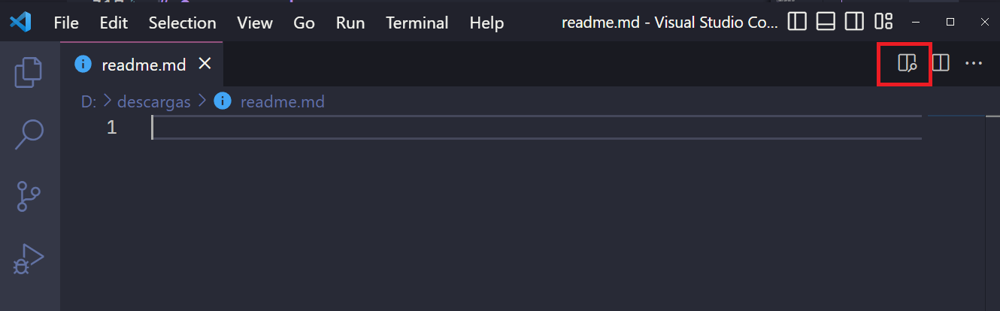
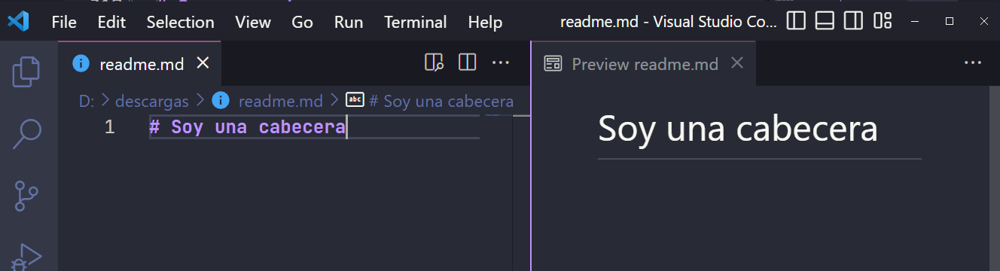

# Introducción a Markdown


<div style="page-break-before:always"></div>

Markdown es un lenguaje de marcado, el cuál nos agrega formato a documentos de texto sin formato. Es decir, si quisiéramos añadir un encabezado **h2** a nuestro texto sería tan sencillo cómo lo siguiente:

```markdown
## Soy un Encabezado
```
Y este sería el resultado que veríamos:

## Soy un Encabezado


Fue Creado por [John Gruber](https://en.wikipedia.org/wiki/John_Gruber) en 2004, y ahora es uno de los lenguajes de marcado más populares del mundo.

<br />

## ¿Por qué se recomienda usarlo?

- Se puede usar en cualquier  plataforma, independientemente del sistema operativo donde se ejecute.
- Se suele usar para crear notas, libros, sitios web, presentaciones, documentos.
- Los archivos con formato Markdown se pueden abrir con cualquier aplicación.

<br />

## Sintaxis

La mejor manera de aprender cómo funciona Markdown es aprender su sintaxis, vamos a ver los distintos tipos más comunes que se suelen utilizar.

### Encabezados

Los encabezados se crean con el carácter **`#`**, este sería equivalente a un **h1**, y según vayamos añadiendo más almohadillas tendríamos **diferentes niveles jerárquicos**.

```markdown
# Encabezado h1
## Encabezado h2
### Encabezado h3
#### Encabezado h4
```

  Este sería su resultado:

# Encabezado h1
## Encabezado h2
### Encabezado h3
#### Encabezado h4

<br />

### Párrafos

Los párrafos se crean usando la etiqueta **`<p>`** o simplemente dejando un espacio en blanco entre dos bloques de texto y de esta forma nos crearía también un salto de línea.

> Cuidado con el uso de etiquetas HTML, ya que en algunos sitios se pueden bloquear para evitar ataques de inyección de código.


```
<p>Soy un Párrafo</p>

Ahora creo una línea

y hago un salto de línea
```

Así se vería el resultado:

<p>Soy un Párrafo</p>

Ahora creo una línea

y hago un salto de línea


### Líneas horizontales

Con **Markdown** podemos crear líneas horizontales, igual que hacemos en HTML con la etiqueta **`<hr>`** , podemos crearla de la siguientes formas:

```markdown
***
o también podríamos usar
---
```

Y aquí vemos nuestra línea horizontal.

---

<br />

### Texto en cursiva

Con **Markdown** podemos escribir texto en cursiva haciendo uso de un asterisco **`*`** o un guion bajo **`_`**.

```markdown
Soy un *texto en cursiva*

Soy otro _texto en cursiva_
```

Y su resultado:

Soy un *texto en cursiva*

Soy otro _texto en cursiva_

<br />

### Texto en negrita

Para resaltar un texto en negrita, **Markdown** nos da dos formas de hacerlo. La primera forma sería haciendo uso de dos asteriscos **`**`**, y la segunda manera con dos guiones bajos **`__`**.

```markdown
Soy un **texto en negrita**.

Una segunda forma de poner el __texto en negrita__.
```

Y así se nos mostraría:

Soy un **texto en negrita**.

Una segunda forma de poner el __texto en negrita__.

Incluso podemos combinar el texto en cursiva y el texto en negrita. Esto sería un par de ejemplos de cómo usarlos.

```markdown
Soy un ***texto en negrita y cursiva***.

Soy otro **_texto en negrita y cursiva_**.
```

Así se sería el resultado:

Soy un ***texto en negrita y cursiva.***

Soy otro **_texto en negrita y cursiva_**.

<br />

### Enlaces

Para crear un enlace con **Markdown**, usaremos corchetes para poner el texto que queremos que aparezca en el enlace y entre paréntesis la URL que va a enlazar el texto.

```markdown
[texto enlace](URL donde vamos a navegar cuando pulsemos en el enlace)

[Visitar Lemoncode.](https://lemoncode.net/)
```

Así nos quedaría si queremos navegar a la página de **Lemoncode**.

[Visitar Lemoncode.](https://lemoncode.net/)

<br />

### Imágenes

Para agregar imágenes con **Markdown** hay dos formas de hacerlo. 

La primera es muy parecida a la forma de agregar un enlace pero añadiendo un signo de exclamación  **`!`** delante, el texto que va dentro de los corchetes será el **alt** de la imagen y entre paréntesis escribiremos la URL de la imagen. 

```markdown

```

 La segunda forma será usando la etiqueta **``** de HTML.

```

```

En este caso nos mostraría el logo de **Lemoncode**.


<br />

### Citas

Para agregar citas en **Markdown** usa el símbolo **`>`**.

```markdown
> Soy una cita

> Soy una cita
>
> que ocupa varios párrafos
```

Así lo veríamos:

> Soy una cita

> Soy una cita
>
> Que ocupa varios párrafos

<br />

### Listas

También podemos agregar listas ordenadas y no ordenadas. 

Para hacer listas ordenadas la lista tiene que empezar por el número **`1`**.

```markdown
1. Primer elemento
2. Segundo elemento
3. Tercer elemento
4. Cuarto elemento
```

Este sería el resultado:

1. Primer elemento
2. Segundo elemento
3. Tercer elemento
4. Cuarto elemento

Si por el contrario queremos una lista no ordenada, agregaremos un guion **`-`**, un asterisco **`*`**  o un signo **`+`** delante de los elementos de la lista.  

```markdown
- Primer elemento
- Segundo elemento
- Tercer elemento
- Cuarto elemento
```

Y cómo lo veríamos.

- Primer elemento
- Segundo elemento
- Tercer elemento
- Cuarto elemento

<br />

### Bloques de código

Con **Markdown** podemos también introducir bloques de código de la siguiente forma, indicándole incluso a qué lenguaje corresponde el código introducido:

````
```csharp
  internal class Program
  {
      public static void Increment(int value)
      {
          value = value + 1;
      }

      static void Main(string[] args)
      {
          var inc = 3;
          Increment(inc);

          Console.WriteLine("Value: " + inc);

          Console.ReadLine();
      }
  }
```
````

Y lo veríamos de la siguiente forma:

```csharp
  internal class Program
  {
      public static void Increment(int value)
      {
          value = value + 1;
      }

      static void Main(string[] args)
      {
          var inc = 3;
          Increment(inc);

          Console.WriteLine("Value: " + inc);

          Console.ReadLine();
      }
  }
```

<br />

### Caracteres especiales

Para dar formato a nuestros textos estamos utilizando caracteres especiales como **`+`**, **`-`** o **`*`** . 

Pero y si ahora quisiéramos utilizarlos, ¿cómo lo haríamos?. Usaríamos la barra invertida **`\`** seguido del carácter especial.

```markdown
- 5 \+ 2 es igual a 7
- 10 \* 10 es igual a 100
- 8 \- 4 es igual a 4
```

De esta forma nos aparecería el símbolo **`-`**,  le estaríamos diciendo que es una lista no ordenada y luego mostraríamos los caracteres.

- 5 \+ 2 es igual a 7
- 10 \* 10 es igual a 100
- 8 \- 4 es igual a 4

<br />

## Markdown con Visual Studio Code

En **Visual Studio Code** podemos editar nuestros archivos **Markdown**, los archivos creados deben de tener la extensión **`.md`**.

Para ver un ejemplo vamos a abrir **Visual Studio Code** y creamos un archivo llamado **readme.md**.

Creamos una cabecera.

```markdown
# Soy una cabecera
```

**Visual Studio Code** nos da una opción para ver una preview del código **Markdown**.



Y este sería el resultado que veríamos.




## Editores de Markdown

Existen muchos editores de *Markdown* tanto online como aplicaciones de escritorio. 

Vamos a pasar varios enlaces con los editores más utilizados.

- [Typora](https://typora.io/)
- [Dillinger](https://dillinger.io/)
- [StackEdit](https://stackedit.io/)
- [Online Markdown Editor](https://onlinemarkdowneditor.dev/)
- [Code Beautify](https://codebeautify.org/markdown-editor)
