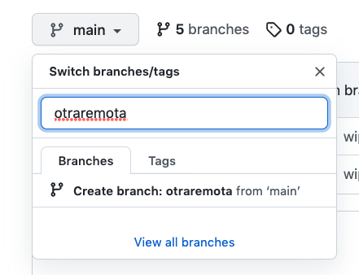

# Introducción


<div style="page-break-before:always"></div>

En *git* las ramas que tengamos activas las vamos a tener tanto en cliente como en servidor, además de esto cuantas más ramas tengamos más complicado va a ser manejarnos.

De hecho en las PR cuando ya mezclamos una rama, *Github* nos da la opción de que la borremos, vamos a ver cómo hacer limpia y que aproximaciones podemos tomar mezclando ramas.

# Manos a la obra

Vamos a crear un repo en blanco en *Github*, lo clonamos y nos liamos
a crear algunas ramas (podemos partir del anterior)

```bash
git checkout main
```

```bash
git branch casocerradoa
```

```bash
git checkout casocerradoa
```

_./readme.md_

```diff
# borrar

Hola git

+ caso cerrado1
```

```bash
git commit -am "wip"
```

```bash
git checkout main
```

```
git branch casocerradob
```

```bash
git checkout casocerradob
```

_./otro.md_

```md
# otro fichero
```

```bash
git add .
```

```bash
git commit -am "wip"
```

```bash
git checkout main
```

```
git branch casoabierto
```

```bash
git checkout casoabierto
```

_./otromas.md_

```md
# otro fichero mas
```

```bash
git add .
```

```bash
git commit -am "wip"
```

Como tenemos varias ramas en local vamos subirlas todas de un tirón

```bash
git push --all origin
```

Vamos ahora a crear las PR desde *Github* para los dos casos cerrados y las mezclamos (dejamos la rama caso abierto), OJO MEZCLAMOS LAS DOS CASOCERRADO PERO NO LAS BORRAMOS.

Antes de seguir, vamos a crear una rama desde el propio *github* (simulando que
otro usuario la crea desde su terminal), la llamaremos otrarama.



Hasta ahora, estamos acostumbrados a listar todas las ramas.

```bash
git branch -al
```

Pero si queremos hacer purga de ramas, lo suyo es ver que ramas están ya *mergeadas* y son candidatas a ser borradas.

```bash
git branch --merged
```

Si queremos poner un punto más de control podemos ver también las ramas que se han *mergeado* solo a _main_.

```bash
git branch --merged main
```

Ahora podemos ir borrando ramas.

Si sólo queremos borrarlo en local:

```bash
git branch -d casocerradoa
```

Si queremos borrarlo en remoto:

```bash
git push origin --delete casocerradob
```

Y podemos hacer que se borre automáticamente en local:

```bash
git fetch --prune
```

¿Qué pasaría si fuéramos a borrar una rama que no esta mezclada?

```bash
git branch -d casoabierto
```

Nos cancela la operación al no estar la rama mezclada y nos dice que si de verdad queremos borrarlo usemos -D como parámetro.
