# VS Code básico


<div style="page-break-before:always"></div>

## VSCode y Git

En estos últimos años unos han manejado *Git* desde la consola (línea de comandos), otros han tirado de herramientas gráficas independientes como *SourceTree* o *GitKraken*, todos huyendo un poco de los *IDE's* integrados que al final te hacían cliente cautivo.

De un tiempo a esta parte se ha levantado *Visual Studio Code*: un editor ligero, potente, multiplataforma y *open source*, que va mejorando por semanas y además se ha ganado la simpatía de muchos sectores. Se nota que detrás de esta herramienta hay personalidades del mundo de la programación como [Erich Gamma](https://en.wikipedia.org/wiki/Erich_Gamma).

En esta sección vamos a aprender manejarnos con este cliente de *Git*, para ello nos clonaremos un repo de *Github* que contiene una aplicación web del tipo "Hola Mundo", e iremos trabajando con ella. Cada paso irá acompañado de gifs animados que nos harán más fácil aprender a cómo usar esta herramienta.

# Clonar un repo

Arrancamos por clonar un repo para ello copiaremos la URL del repo (en este caso tenemos el repo en *github* pero funcionaría desde *bitbucket*, *gitlab*, *vsts* u otro).

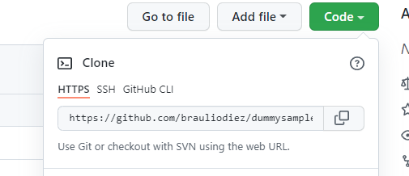

Para clonar un repo, lo podemos hacer desde la paleta de comandos.

\- Para mostrar la paleta de comandos: podemos pulsar la combinación de teclas *CTRL+SHIFT+P* o desde el menú *view* seleccionamos *"command palette"*.

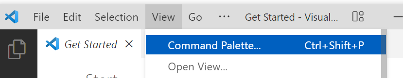

\- Desde ahí tecleamos *git clone* nos pide la ruta del repositorio y ya ponemos clonar (si es necesario nos pide credenciales).

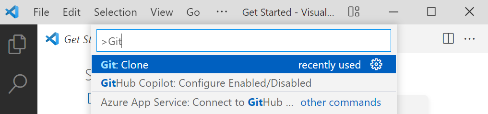

# Introduzco cambios, commit

Conforme vamos introduciendo cambios en los ficheros estos se nos marcan como modificados o añadidos.

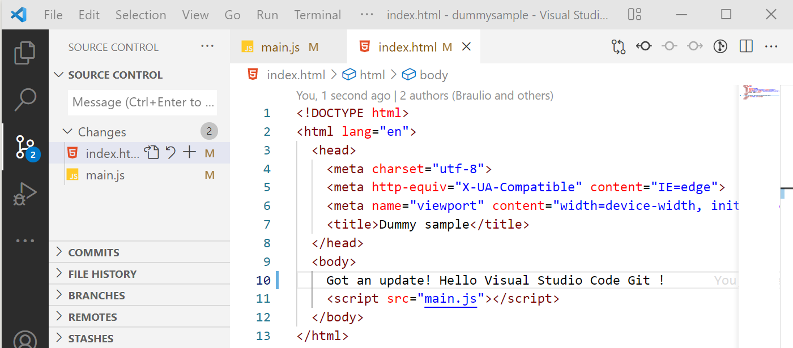

Cuando queramos subir cambios nos vamos a la pestaña de *git* y vemos de que ficheros queremos hacer *stage* (podemos ir pulsando en "+" fichero a ficheros o en todos, también podemos directamente darle a *commit* y decirle que haga *stage* de todos los ficheros).

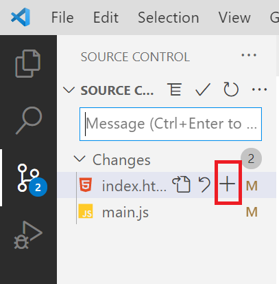

Una vez que estamos listos le damos al botón de *commit* (esto sólo guarda en local, tenemos que hacer un *push* para llevar los cambios a servidor).

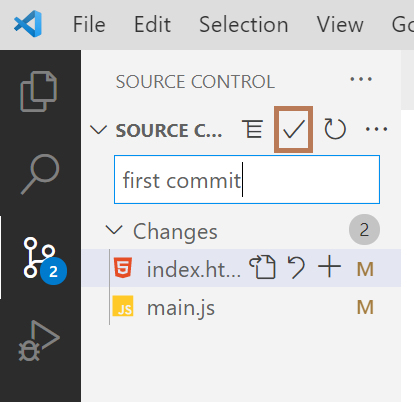

# Hacer push de los cambios

Para hacer push de los cambios podemos hacerlo de dos maneras:

\- O bien pulsando en la parte derecha de la barra de *git* (icono tres puntos) y eligiendo la opción *push*

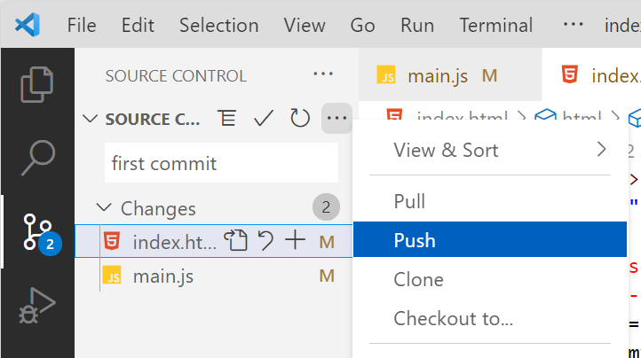

*-* O bien en la parte inferior pulsando sobre sincronizar (ojo esto haría *push* y *pull*).

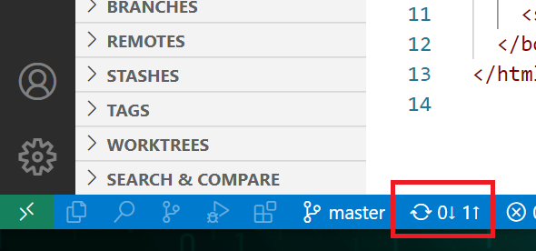

# Como hacer un pull

Para traernos los cambios que haya en servidor de la rama en la que estamos trabajando, podemos pulsar sobre los tres puntos *(...)* que hay en la parte superior derecha y pinchar sobre la opción *pull.*

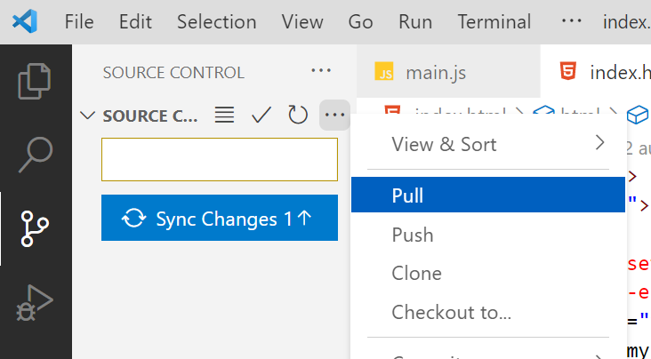

También podríamos hacer como en el paso anterior (pulsando en los iconos de la parte inferior, sincronizar). Está opción la suelo usar mucho, es cómoda.

# Sincronizar: Push y pull

Si queremos traernos los cambios últimos que se hayan realizado en nuestra rama y subir los nuestros podemos sincronizar el repo, pulsando sobre el icono inferior de sincronización que están en la parte de abajo de la ventana (si trabajamos con Branch per *feature* normalmente sólo haremos operaciones de *push* o de *pull* aunque le demos a sincronizar).

En el ejemplo que vamos a ver tenemos varios cambios en servidor y un fichero que hemos actualizado en local (por eso nos salen tres *commits* por bajar y un cambio por subir, cuando pinchamos en el icono baja el cambio pertinente y sube el nuestro).

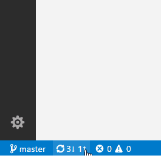

# Resolver conflictos

¿Qué pasa si quiero hacer *pull* de mi rama pero trae cambios y conflictos de servidor? ¿Cómo soluciona esto *Visual Studio Code*?

En este caso hemos puesto un conflicto en el fichero main.js, tenemos que decidir con que cambio nos quedamos. Para ello:

- Hacemos *pull* y nos sale el fichero con el conflicto, pinchamos sobre el fichero y vemos donde están los conflictos.
- Ahora podemos elegir que parte es la que queremos tomar como buena (la nuestra o la de servidor) y la aceptamos:

 *También podemos escribir en una de las partes y aceptar los cambios, o aceptar ambos cambios como buenos:*

- Una vez que hemos terminado, tenemos que hacer un *commit* con el *merge*, para ellos nos vamos al terminal y ejecutamos la siguiente orden.

```bash
git commit -m "fixing merge conflicts"
```

# Creando ramas

Podemos crear una rama mostrando la paleta de comandos (CTRL+SHIFT+P) y eligiendo el comando *git branch*, después nos preguntará por el nombre de rama. Una vez creada en local, podemos subirla al servidor pulsando sobre el indicador de la nube que aparece en la parte inferior de la ventana.

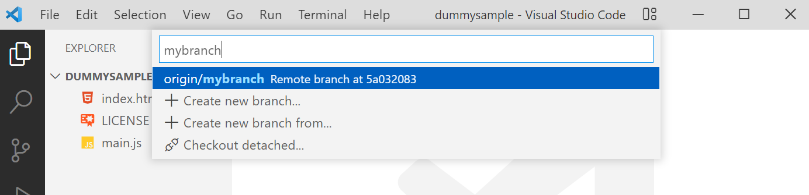

# Cambiar de rama

Para cambiar de rama, pinchamos sobre la parte inferior en la que aparece el nombre de la rama actual, y nos aparece un diálogo en el que podemos teclear el nombre de la rama al que queremos navegar.

*Importante para poder cambiar de ramas no debemos de tener ficheros locales con cambios.*

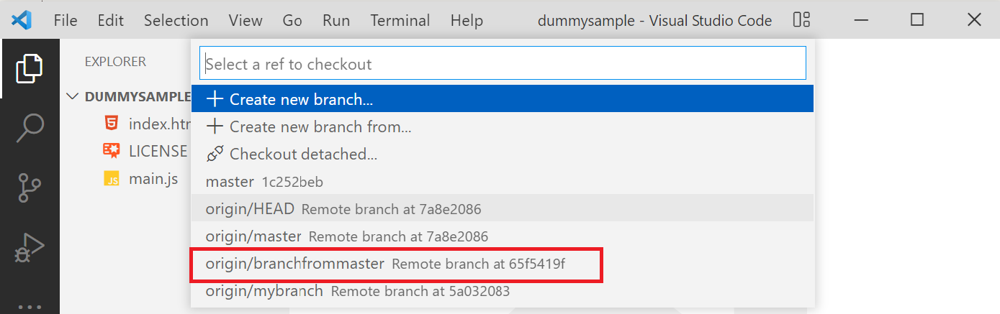

¿Qué pasa si la rama a la que quiero hacer *checkout* no aparece? (no se ha sincronizado con el servidor), puedo teclear desde el terminal:

```bash
git fetch
```

Y ahora si le volvemos a dar a la opción de cambiar de rama, podremos ver la lista actualizada.

# Descartar cambios

Para descartar cambios sobre un fichero, desde la ventana de *git* podemos pinchar con el botón derecho sobre el fichero que queramos descartar y elegimos la opción *Discard.*

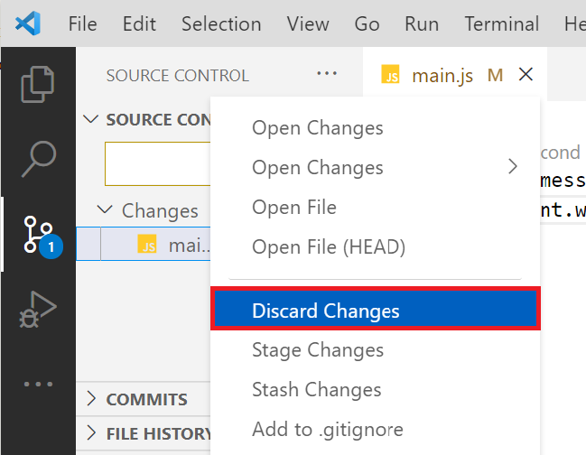

# Mezclar máster a mi rama

Supongamos el caso en que mi rama se ha quedado desactualizada con respecto a máster y me quiero traer los cambios (tengo suerte y no hay conflictos), para hacer esto abro la paleta de comandos y tecleo *git merge* con ese comando me pregunta que rama quiero mezclar a la actual, tecleo su nombre y realizo el *merge*.

*Si tuviéramos conflictos haríamos como en el caso anterior (arreglar conflictos en misma rama).*

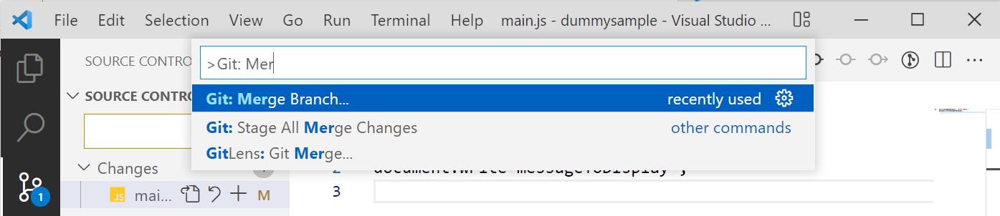

# Conclusiones...

*VSCode* trae un cliente de Git ligero y práctico, a caballo entre una herramienta de interfaz de usuario y tirar de línea de comandos.

Espero que te haya gustado esta guía y que vuelvas de vez en cuando a revisar ese paso del que no te acordabas :-).
