# Visual Studio y Git


<div style="page-break-before:always"></div>

En la anterior lección hemos visto como trabajar con Git desde Visual Studio Code, pero ¿y si queremos trabajar con Visual Studio? ¿Cómo podemos integrar Git en Visual Studio?

# Clonar un repositorio

Para clonar un repositorio en Visual Studio, lo primero que tenemos que hacer es abrir Visual Studio y seleccionar la opción **Clone a repository**.

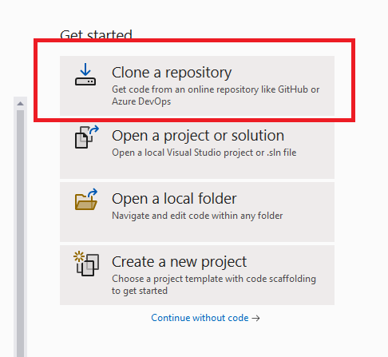

A continuación, nos aparecerá una ventana en la que tendremos que introducir la URL del repositorio que queremos clonar y la ruta donde queremos clonarlo.


# Introduzco cambios en el repositorio

Una vez clonado, podemos introducir cambios en el repositorio. Para ello, abrimos el archivo `README.md` y lo editamos.

```diff
- respositorio clonado desde Visual Studio
+ # Curso de Git de Lemoncode
```

Dentro de Visual Studio podemos ver los cambios que hemos introducido. Para ello pulsamos en el botón ***Git Changes***.

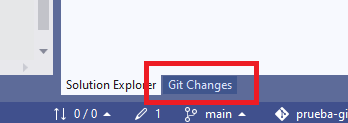

Ahora podemos ver los cambios realizados. Para añadir los cambios al repositorio, pulsamos en el botón ***Stage***. Una vez añadidos los cambios, añadimos un mensaje de *commit* y pulsamos en el botón ***Commit***.

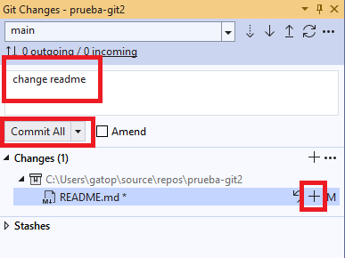

# Subir los cambios al repositorio remoto

Para subir los cambios al repositorio remoto, pulsamos en el botón ***Push***.

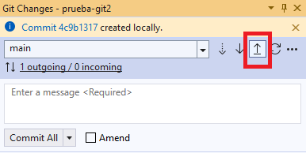

# Cómo hacer un Pull

Para traernos los cambios que hay en una rama remota y que no tenemos en local, pulsamos en el botón ***Pull***.

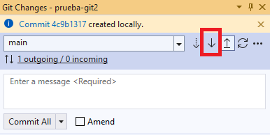

# Cómo crear una rama

Para crear una rama, pulsamos en el botón ***Git*** y luego en ***New Branch***.

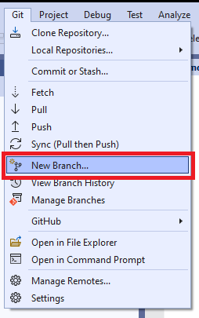

A continuación, introducimos el nombre de la rama y pulsamos en el botón ***Create***.

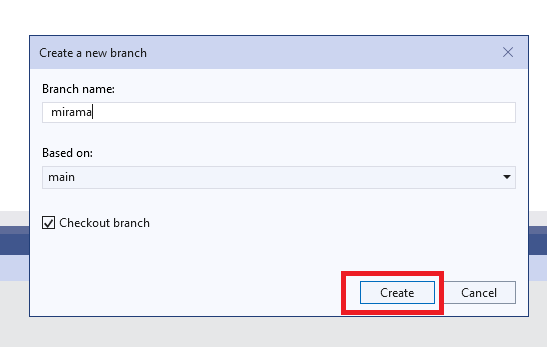

# Cómo cambiar de rama

Para cambiar de rama, nos vamos al menú de ***Git Changes*** y nos aparece un desplegable con las ramas que tenemos en el repositorio. Seleccionamos la rama a la que queremos cambiar y automáticamente nos cambia a la rama seleccionada.

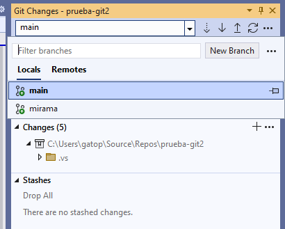

# Cómo hacer un merge

En nuestro ejemplo tenemos la rama _master_ y la rama _mirama_. En la rama _mirama_ hemos introducido cambios en el archivo `README.md` y queremos añadir esos cambios a la rama _master_.

_README.md_

```diff
# Curso de Git de Lemoncode
+ Este es un ejemplo de merge
```

Hacemos un _commit_ de los cambios que hemos introducido en la rama _mirama_. Y hacemos un _push_.

Para hacer un merge, nos vamos a la rama _master_ y pulsamos en el botón ***Git*** y luego ***Manage Branches***.

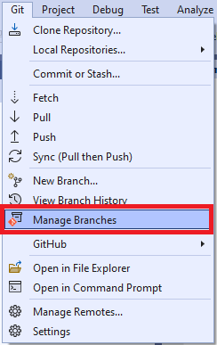

A continuación, nos aparece una ventana en la que podemos ver las ramas que tenemos en el repositorio. Seleccionamos la rama _mirama_ y pulsamos botón derecho y en ***Merge mirama into main***.

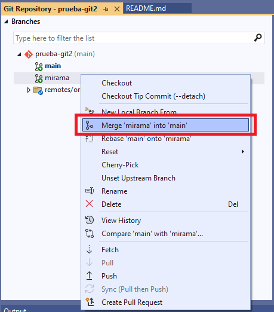

# Conflictos

Vamos ahora a generar un conflicto y aprender a resolverlo. Para ello, vamos a crear dos archivos en la rama _master_.

```js
console.log("*****************");
console.log("soy el fichero a");
console.log("*****************");
```

_ficherob.js_

```js
console.log("*****************");
console.log("soy el fichero b");
console.log("*****************");
```

Hacemos un _commit_ y un _push_ de los cambios que hemos introducido en la rama _master_.

Ahora vamos a la rama _mirama_ y creamos esos dos archivos pero con contenido diferente.

_ficheroa.js_

```diff
- console.log("*****************");
+ console.log("+++++++++++++++++");
console.log("soy el fichero a");
- console.log("*****************");
+ console.log("+++++++++++++++++");
```

_ficherob.js_

```diff
- console.log("*****************");
+ console.log("-----------------");
- console.log("soy el fichero b");
+ console.log("soy el segundo fichero");
- console.log("*****************");
+ console.log("-----------------");
```

Vamos a subir los cambios

Ahora vamos a volver a la rama _master_ y vamos a hacer un cambio en el fichero _ficherob.js_.

_ficherob.js_

```diff
console.log("*****************");
- console.log("soy el fichero b");
+ console.log("fichero II");
console.log("*****************");
```

Hacemos un _commit_ y un _push_ de los cambios que hemos introducido en la rama _master_.

Ahora vamos a realizar un _merge_ de la rama _mirama_ en la rama _master_ y vemos que nos aparece un conflicto.

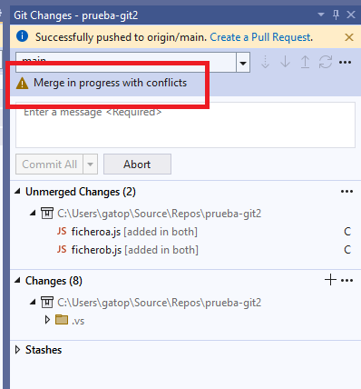

Pulsamos en ***Resolve the conficts*** y nos aparece una ventana en la que podemos ver los conflictos que tenemos.

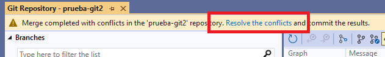

En el fichero _ficherob.js_ tenemos un conflicto. Podríamos elegir quedarnos con la versión de la rama _master_ o con la versión de la rama _mirama_.

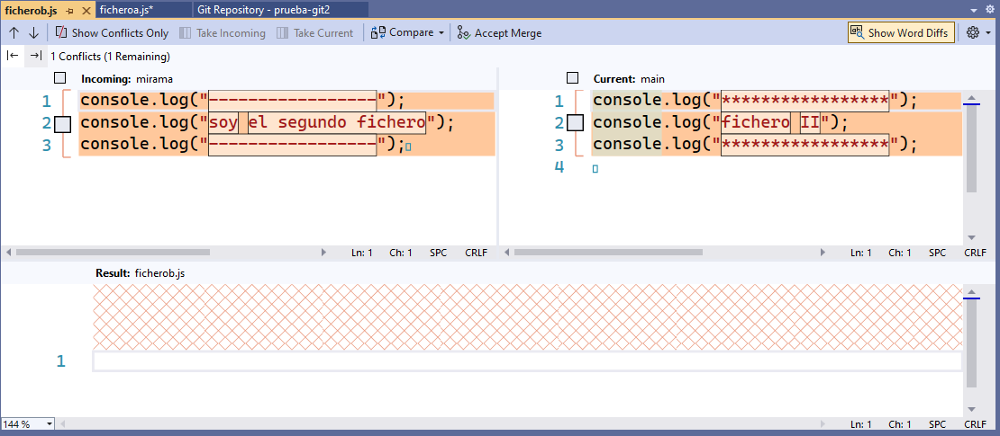

Ahora podemos aceptar los cambios que nos llegan de la rama _master_ o podemos aceptar los cambios que nos llegan de la rama _mirama_. Para aceptar los cambios de la rama _master_ pulsamos en el botón **Take Current** y para aceptar los cambios de la rama _mirama_ pulsamos en el botón **Take Incoming**.

Lo mismo haríamos con el fichero _ficheroa.js_.

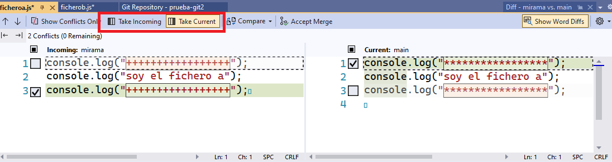

O incluso podrías mezclar los cambios de ambas ramas.

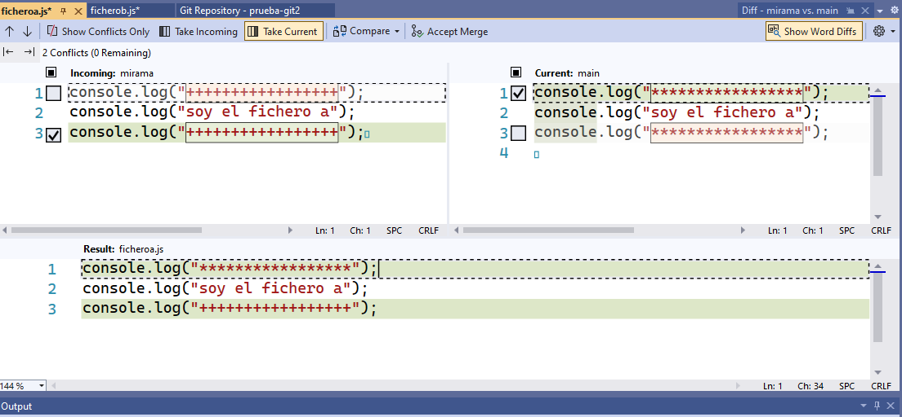

Una vez que hemos resuelto los conflictos, pulsamos en el botón **Accept Merge**.

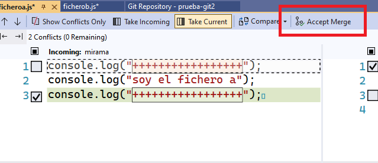


